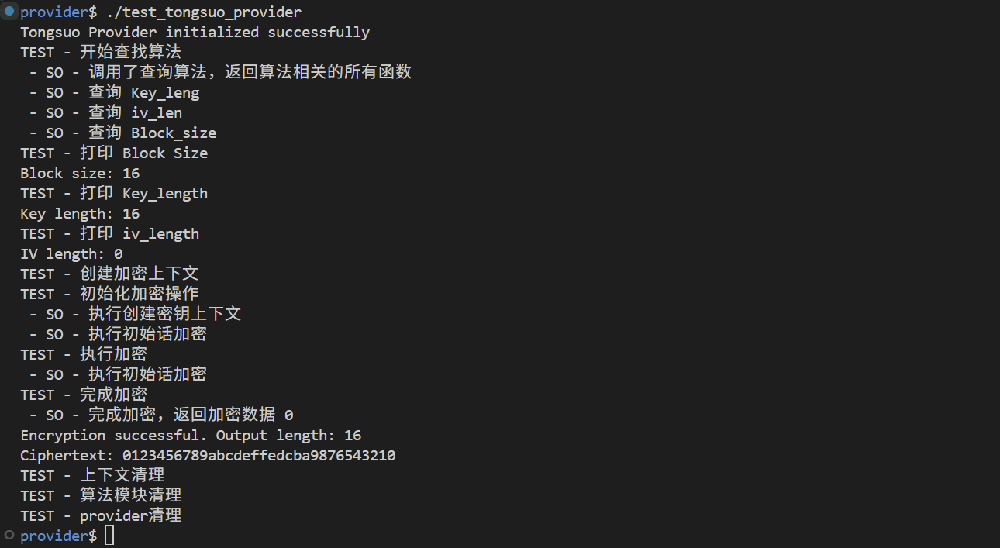

# Tongsuo Provider 简介

本项目实现了一个 OpenSSL Provider 示例，包含自定义的随机数（RAND）和国密 SM4 算法。主要内容包括：

- `libtongsuo_provider.so`：核心 Provider 动态库，支持 SM4 加密和简单随机数生成。
- simple_sm4.c：SM4 ECB 加密算法实现。
- simple_rand.c：自定义 RAND 算法实现，演示如何集成随机数生成。
- test_tongsuo_provider.c：测试程序，验证 Provider 的加载和算法功能。
- Makefile：编译和测试脚本，支持一键构建和清理。

## 编译与测试

```sh
1、首先确保安装了 Tongsuo 或 OpenSSL 3.0+ 开发包，编译 provider 为动态库:

gcc -shared -o tongsuo-provider.so -fPIC tongsuo_provider.c -I/opt/tongsuo/include -L/opt/tongsuo/lib64 -lcrypto

2、编译测试程序:

gcc -o test_tongsuo_provider test_tongsuo_provider.c -I/opt/tongsuo/include -L/opt/tongsuo/lib64 -lcrypto

3、运行步骤：
3.1 首先设置库路径（如果需要）:
export LD_LIBRARY_PATH=/opt/tongsuo/lib64:$LD_LIBRARY_PATH

cp tongsuo-provider.so /opt/tongsuo/lib64/ossl-modules/


./test_tongsuo_provider


4. 预期输出

如果一切正常，会看到类似以下输出:


Tongsuo Provider initialized successfully
Encryption successful. Output length: 16
```

## 适用场景

- 学习 OpenSSL Provider 开发流程
- 国密算法扩展与集成
- 随机数与加密算法的自定义实现

---

